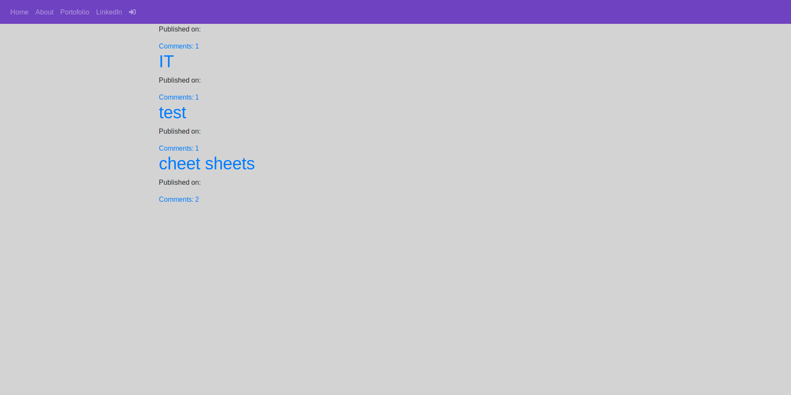
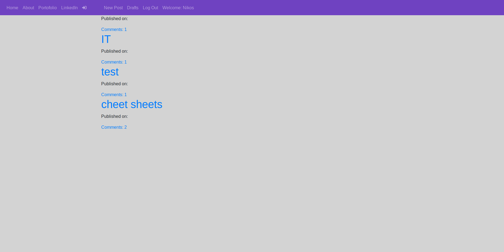

# Django-Portofolio-Blog-WebApp

Side project i'm currently working on, portofolio+blog webapp

Current bugs:

- When you authenticate as a super user or normal user the old navigation menu is still showing up with the new one  
  
  
- Draft page's contents are not being displayed

`Style:`

- Basic bootstrap

* Almost none css (besides body)

I'm planing when i'll fix the bugs to update the entire front-end style and add more
